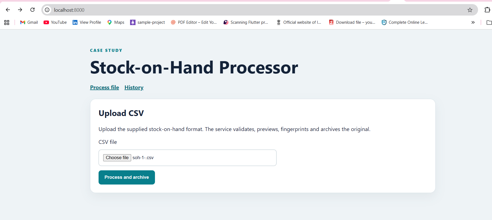
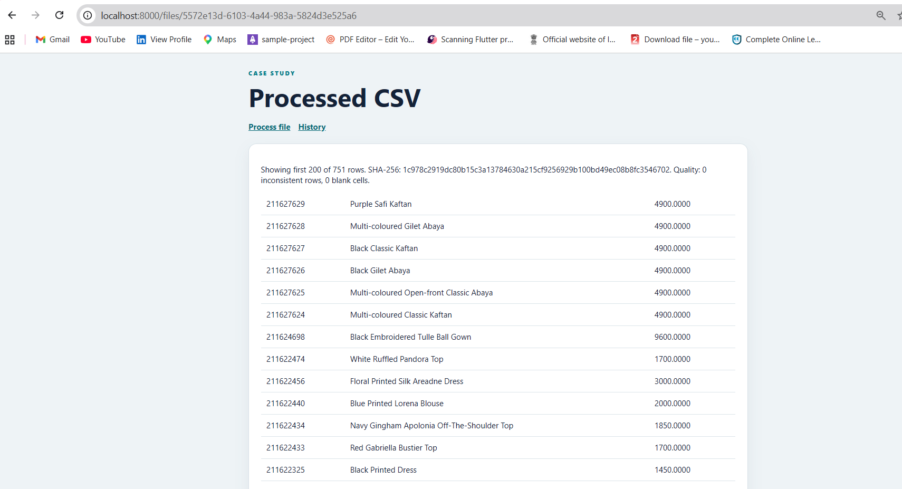
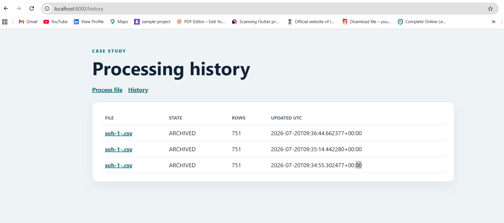
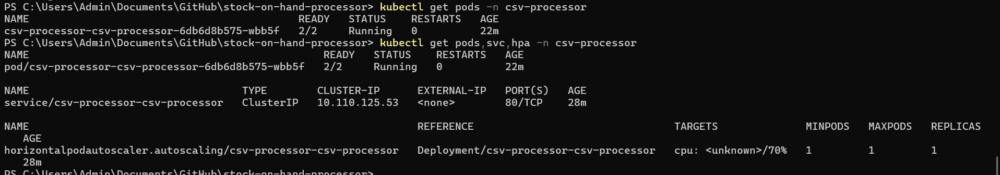

# Stock-on-Hand CSV Processor

A small FastAPI application that accepts stock-on-hand CSV files, validates them, produces a quality summary, and records processing metadata.

Author: Preethi Agnes

## What it includes

- CSV upload, validation, preview, checksum, and quality report
- Explicit processing states: `RECEIVED`, `VALIDATED`, `ARCHIVED`, and `FAILED`
- S3 storage and DynamoDB metadata for AWS deployments
- Local-storage mode for development
- FastAPI and Nginx in the same Kubernetes Pod
- Helm chart, HPA, PodDisruptionBudget, and health probes
- Terraform, Ansible, kOps configuration, and GitHub Actions

## Request flow

1. Nginx receives the HTTP request and forwards it to FastAPI.
2. FastAPI validates the CSV and calculates its SHA-256 checksum.
3. The application creates a quality report and updates the processing status.
4. In AWS mode, the CSV is stored in S3 and its metadata is stored in DynamoDB.
5. In local mode, files and metadata are kept on the local filesystem.

See [docs/architecture.md](docs/architecture.md) for the architecture diagram.

## Local verification

The published Docker image was deployed to a local Kubernetes cluster using the Helm chart.

### Home page



### Processed CSV



### Processing history



### Kubernetes resources



## Run with Docker

```bash
docker build -t stock-on-hand-processor:local .
docker run --rm -p 8000:8000 -e LOCAL_STORAGE=true stock-on-hand-processor:local
```

Open `http://localhost:8000`.

## Validate

```bash
python -m pip install -r requirements-dev.txt
python -m pytest -q
helm lint helm/csv-processor
terraform -chdir=infra/s3 init -backend=false
terraform -chdir=infra/s3 validate
```

## Deploy with Helm

Set the image repository and tag to an image that is available to the Kubernetes cluster:

```bash
helm upgrade --install csv-processor helm/csv-processor \
  --namespace csv-processor \
  --create-namespace \
  --set image.repository=DOCKERHUB_USER/stock-on-hand-processor \
  --set image.tag=IMAGE_TAG \
  --set s3.localStorage=true
```

For AWS, set `s3.localStorage=false`, provide the S3 bucket and DynamoDB table, and associate the Helm service account with the IRSA role.

## Infrastructure

- `infra/s3`: S3, DynamoDB, IAM, lifecycle policy, and optional IRSA
- `infra/kops`: cluster and worker instance-group definitions
- `ansible`: application configuration and Helm deployment automation
- `.github/workflows`: validation, image publishing, deployment, and destruction

Terraform remote state is kept in a separate S3 bucket. That bucket and its lock table are intentionally not destroyed with the application environment.

## Design choices

- FastAPI keeps the application small and provides clear health/API endpoints.
- DynamoDB stores processing metadata without tying it to a Pod filesystem.
- `emptyDir` is used only for files shared by Nginx and FastAPI within one Pod.
- Workload access to AWS uses IAM roles rather than static credentials.
- On-Demand workers provide baseline capacity; Spot workers reduce cost for replaceable capacity.

## Limitations

- CSV processing is synchronous and intended for small or medium files.
- Local-storage mode is for development and is not durable across Pod replacement.
- Large files should be processed asynchronously using object-storage events and a worker queue.

