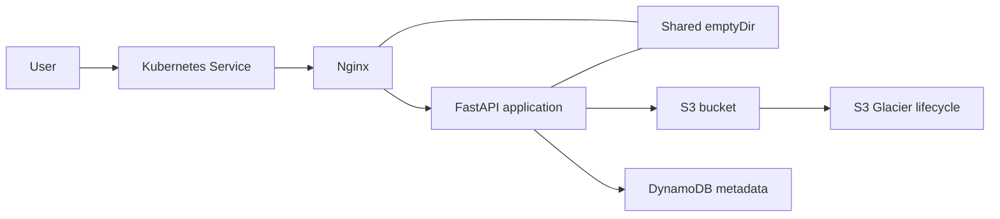

# Architecture

Author: Preethi Agnes

Nginx and FastAPI run as separate containers in the same Pod. The `emptyDir` volume is limited to temporary files shared inside that Pod. Application data is stored in S3, while job status, checksum, and quality metadata are stored in DynamoDB.

The Kubernetes cluster uses an On-Demand worker baseline with additional Spot capacity. The Horizontal Pod Autoscaler scales application Pods, while Cluster Autoscaler adjusts worker capacity when Pods cannot be scheduled.

AWS access is provided through the Kubernetes service account and IRSA, so AWS credentials are not stored in the image or Helm values.
